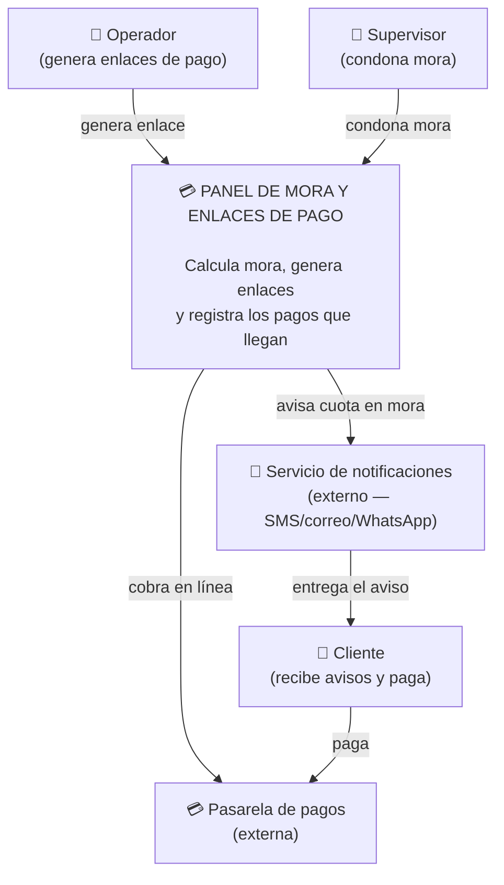
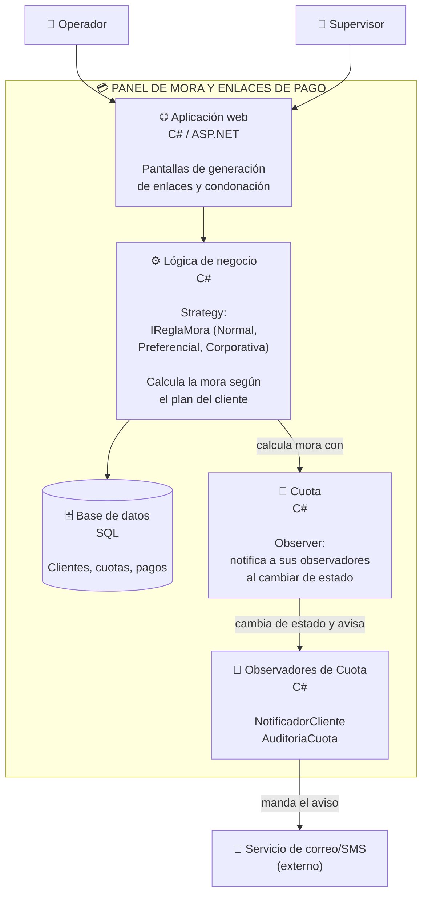

Parte A Nivel 1: Contexto (el sistema y su mundo)
mis primeros actores son los que defini en mi RF4 (Operador, supervisor) mas mi cliente que recibe avisos y paga
y los externos son la pasarela de pagos y mi canal de notificaciones

Parte A Nivel 2 contenedores (el zoom adentro del sistema)
Aqui muestro el zoom adentro, con los dos patrones que use: Strategy para el calculo de mora y Observer para avisar cuando una cuota cambia de estado.

