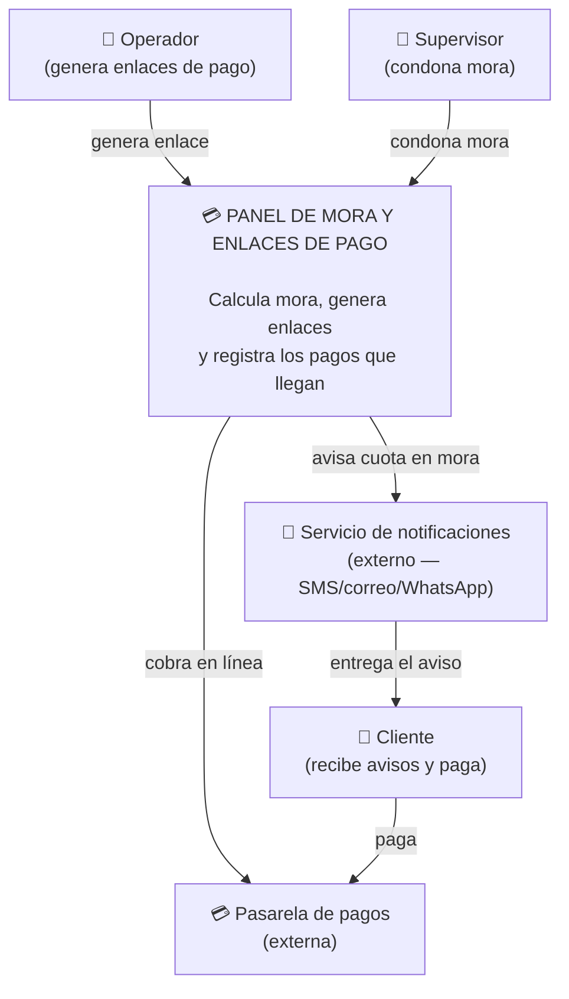

Parte A Nivel 1: Contexto (el sistema y su mundo)
mis primeros actores son los que defini en m i RF4(Operador, supervisor) mas mi cliente que recibe avisos y paga
y los externos son la pasarela de pagos y mi canal de notificaciones


Parte A Nivel 2 contenedores (el zoom adentro del sistema)
Aqui muestro el zoom adentro, con el patron factory  que llegarian a ser mis canales de aviso.
```mermaid
flowchart TD
    Operador["👤 Operador<br/>(genera enlaces de pago)"]
    Supervisor["👤 Supervisor<br/>(condona mora)"]
        subgrafo sistema["💳 PANEL DE MORA Y ENLACES DE PAGO<br/><br/>Calcula mora, genera enlaces<br/>y registra los pagos que llegan"]
        Web["🌐 Aplicación web<br/>C# / ASP.NET<br/><br/>Pantallas de generación<br/>de enlaces y condonación"]
        Logica["⚙️ Lógica de negocio<br/>C#<br/><br/>Cálculo de mora, cuotas,<br/>enlaces<br/><br/>(SOLID y patrones)"]
        BD[("🗄️ Base de datos<br/>SQL<br/><br/>Clientes, cuotas, pagos")]
        Notificaciones["📧 Servicio de notificaciones<br/>(externo — SMS/correo/WhatsApp)"]
    end
    ServicioExterno["📧 Servicio de correo/SMS<br/>(externo)"]
    Operador --> Web
    Supervisor --> Web
    Web --> Logica
    Logica --> BD
    Logica -->|cuota entra en mora| Notificacion
    Notificacion --> ServicioExterno
```
