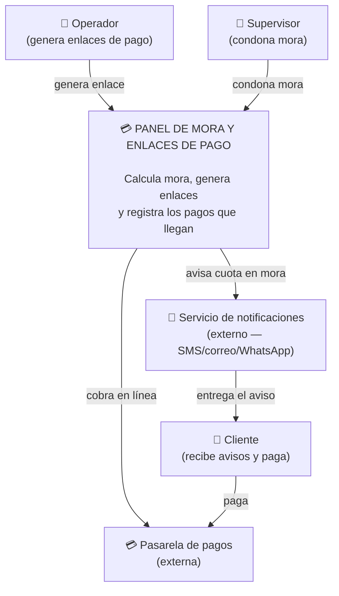

Parte A Nivel 1: Contexto
mis primeros actores son los que defini en m i RF4(Operador, supervisor) mas mi cliente que recibe avisos y paga
y los externos son la pasarela de pagos y mi canal de notificaciones

